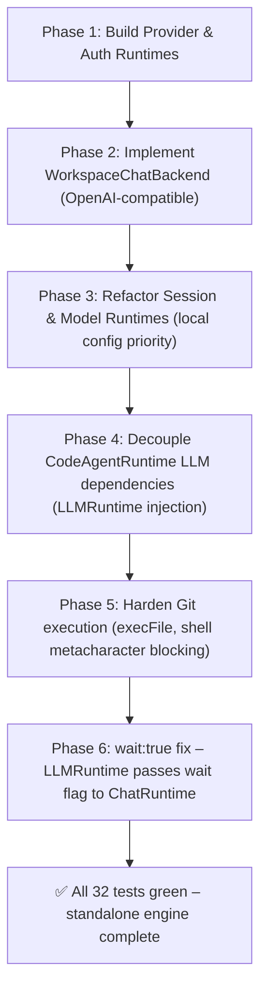

# Hermes Agent Code Import Strategy — Completion Summary

This document records the architectural work that established a standalone
AI Workspace Engine independent of the Hermes Desktop App.

---

## 1. Core Principles (Achieved)

1. **Standalone Operation**: AI Workspace functions independently of the Hermes
   Desktop App and the legacy `hermes serve` process. `HERMES_SERVER_URL` is
   optional; omitting it runs the engine fully self-contained.
2. **First-Class Workspace Ownership**: Configuration, credentials, sessions,
   tasks, diffs, and approvals all reside in `.ai-workspace/`.
3. **Graceful Compatibility Layer**: Legacy `/api/hermes/*` routes and
   `HERMES_SERVER_URL` are retained as opt-in fallback bridges only.

---

## 2. Implemented Module Map

| Component | Location | Status |
| :--- | :--- | :--- |
| **ProviderRuntime** | `server/lib/provider-runtime.mjs` | ✅ Done |
| **AuthRuntime** | `server/lib/auth-runtime.mjs` | ✅ Done |
| **ModelRuntime** | `server/lib/model-runtime.mjs` | ✅ Done |
| **SessionRuntime** | `server/lib/session-runtime.mjs` | ✅ Done |
| **ChatRuntime** | `server/lib/chat-runtime.mjs` | ✅ Done |
| **WorkspaceChatBackend** | `server/lib/workspace-chat-backend.mjs` | ✅ Done |
| **HermesCompatChatBackend** | `server/lib/chat-runtime.mjs` | ✅ Legacy shim |
| **LLMRuntime** | `server/lib/llm-runtime.mjs` | ✅ Done |
| **CodeAgentRuntime** | `server/lib/code-agent-runtime.mjs` | ✅ Done |
| **hermes-compat** | `server/lib/hermes-compat.mjs` | ✅ Legacy shim only |

### Modules excluded as intended
- Hermes Dashboard UI & session cookies
- Process spawning / shell wrapper (`hermes serve`)
- `HermesAgentAdapter` (fully removed)

---

## 3. Phase-by-Phase Integration Roadmap — Final State

---

## 4. Remaining Work

| Area | Status |
| :--- | :--- |
| docsearch-mcp RAG integration | Future |
| Ollama local model driver | Future |
| Apple Client polish (dark mode, approval UI) | In progress |
| MCP tool routing in WorkspaceAgentEngine | Future |
